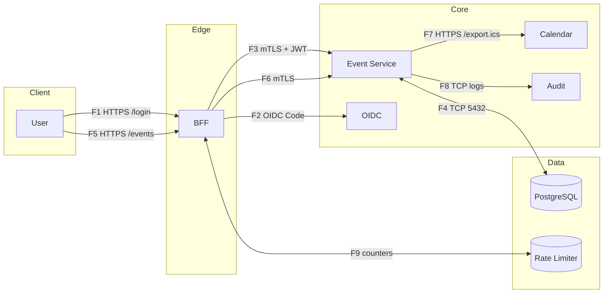

# DFD — Data Flow Diagram (Event Planner)

Диаграмма с границами доверия и потоками F1…F9.

```mermaid
flowchart LR
  subgraph Client
    U[User]
  end

  subgraph Edge
    BFF[BFF]
  end

  subgraph Core
    SVC[Event Service]
    AUTH[OIDC]
    CAL[Calendar]
    AUD[Audit]
  end

  subgraph Data
    DB[(PostgreSQL)]
    RL[(Rate Limiter)]
  end

  U -->|F1 HTTPS /login| BFF
  BFF -->|F2 OIDC Code| AUTH
  BFF -->|F3 mTLS + JWT| SVC
  U -->|F5 HTTPS /events| BFF
  BFF -->|F6 mTLS| SVC
  SVC <--> |F4 TCP 5432| DB
  SVC -->|F7 HTTPS /export.ics| CAL
  SVC -->|F8 TCP logs| AUD
  BFF <--> |F9 counters| RL
```
